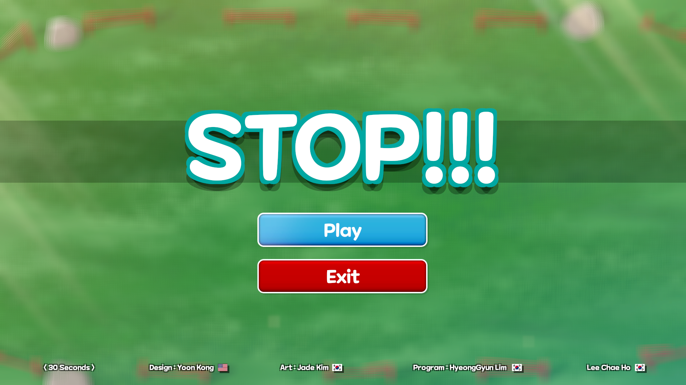
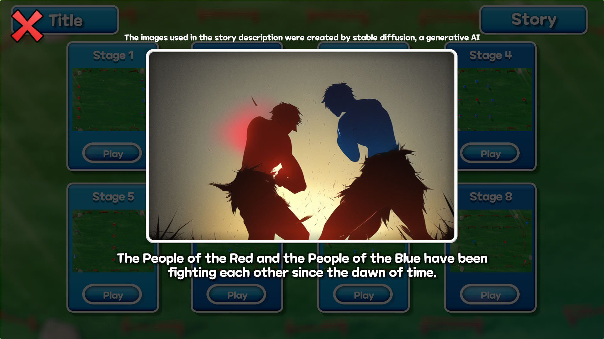
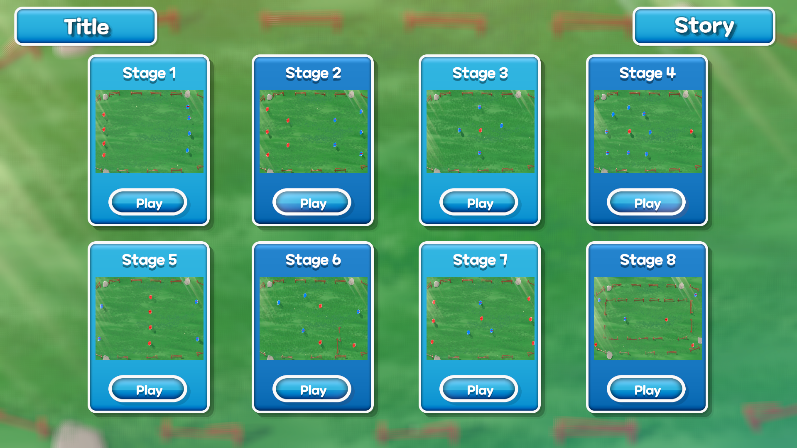
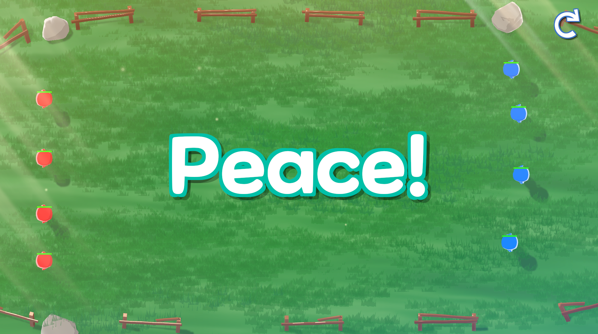
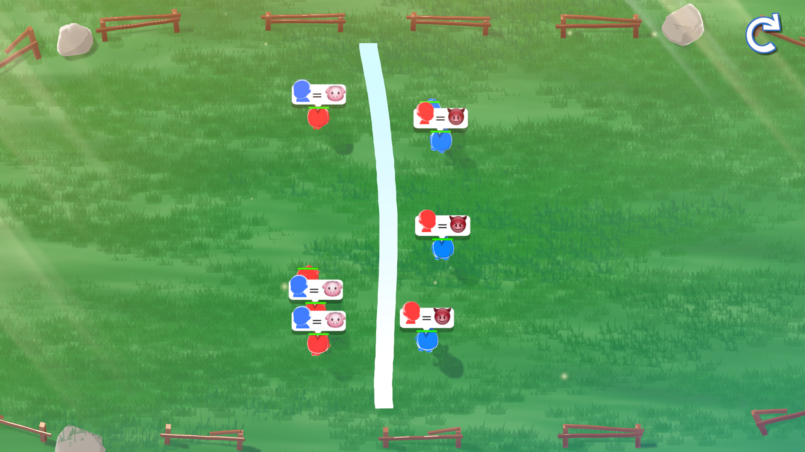

<!-- HEADER --!>

<h1> Stop_It </h1>

  

<li> 개발기간: 2023.07.28 ~ 2024.07.30
<li> 개발인원: 기획:1 아트:1 프로그래머:2
<li> 형상관리툴: GitHub

<!-- Contents --!>
<h2 id="table-of-contents"> :book: 목차 </h2>

  
목차

  <ol>
    <li><a href="#about-the-project"> 프로젝트 설명 </a></li>
    <li><a href="#overview"> 게임개요 </a></li>
    <li><a href="#project-files-description"> 프로젝트 파일 </a></li>
    <li><a href="#tech"> 기술/프레임워크 </a></li>
    <li><a href="#screen-shot"> 스크린샷</a></li>
    <li><a href="#download-link"> 게임 다운로드 </a></li>
  </ol>

<h2 id="about-the-project"> 1. 프로젝트 설명 </h2>

<b> 하이퍼캐주얼 한붓그리기게임 </b>

StopIt!은 하이퍼캐주얼 한붓그리기 게임입니다. 
서로 다른 부족 도깨비들이 마주치기만하면 싸움을 일으키자 지켜보던 창조주가 더 이상 이대로 둘 수 없다고 생각하여 벽을 세워 두 부족을 분리시키게 됩니다. 
여러분이 창조주가 되어 사상자가 일어나기 전 두 부족을 일정시간 이상 분리시키는 것이 목적입니다.

<h2 id="overview"> 2. 게임개요 </h2>
게임 제작은 제 1회 글로벌게임잼 in 전북에서 팀11이 함께 제작하였습니다. 
<a href="https://github.com/LimHyeongGyun">LimHyeongGyun</a>은 클라이언트 개발을 담당하고 있습니다. 플레이어 움직임, 한붓그리기, 게임시스템 담당하였습니다.

(readme 작성자인 LimHyeongGyun의 파트만 기술 하였습니다.)

<h2 id="project-files-description"> 3. 프로젝트 파일 (Stop_It/Assets/Draw, Player) </h2>
<li><b>/Draw</b> - </li>
<li><b>/Player</b> - </li>

<h2 id="tech"> 4. 기술/프레임워크 </h2>
<li>Programming </li>
<li>Framework </li>

<h2 id="screen-shot"> 5. 스크린샷</h2>

</a>
</a>
</a>
 

<게임 플레이 사진>

<h2 id="download-link"> 6.게임 다운로드</h2>
<li>https://drive.google.com/drive/folders/1BfMmo1ZSj39TPWGywhvWeOsDKiYvwLWb
<h2 id="Pv-link"> 7.Pv영상 링크</h2>
<li>https://youtu.be/r2C3uN4v4VA?si=6s4Vgq_Tci0bhnqz
